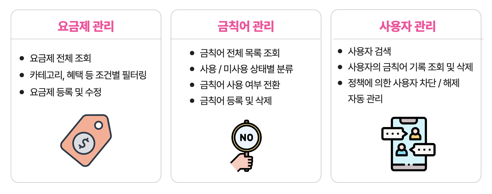

# 관리자 모듈 (Admin Backend)

이 모듈은 MSA 환경에서 관리자(Admin) 기능을 담당합니다.
금칙어 관리, 허용어 관리, 사용자 관리, 요금제 관리, 그리고 사용자 금칙어 채팅 기록 조회·삭제 기능을 제공하며, 운영자가 시스템을 모니터링하고 제어할 수 있는 역할을 합니다.

---

## 기술 스택
- **Spring Boot 3.5.0**: 백엔드 프레임워크
- **Spring Data JPA (Hibernate)**: RDBMS 연동
- **Spring Web**: REST API
- **Spring WebFlux (WebClient)**: 외부 서비스 연동
- **Spring Data Redis**: 금칙어/허용어 캐싱
- **MySQL**: 운영 DB
- **Lombok**: 반복 코드 제거
- **JUnit & Spring Boot Test**: 단위/통합 테스트

## 금칙어 정책
한 번의 채팅에서 N 개의 금칙어가 발견되면, 금칙어 정책 위반 횟수는 N 번

1. 30번 정책 위반시에, 당일 자정까지 이용 불가
2. 50번 정책 위반시에, 다음날 자정까지 이용 불가
3. 100번 정책 위반시에, 일주일 후 자정까지 이용 불가
4. 300번 정책 위반시에, 2주 후 자정까지 시스템 이용 불가
5. 500번 정책 위반시에, 한달 후 자정까지 시스템 이용 불가
6. 1000번 정책 위반시에, 영구 정지

## 금칙어 관리 및 사용자 차단 & 차단 해제 흐름
1. 금칙어 등록/삭제/토글
   - DB에 금칙어 저장/삭제/업데이트
   - Redis Set에 추가/제거
   - 챗봇 필터 모듈에 WebClient로 동기화 호출

2. 사용자 채팅 내 금칙어 검출
   - 채팅 시스템이 Redis에서 금칙어 목록 조회
   - 메시지 내 금칙어 감지 후 단어 리스트 서버 전송
   - POST /chats로 수신하여 DB 저장
   - 저장 전후 count 비교 후 임계치 초과 시 /user/status API 호출로 차단

3. 차단 해제(언밴)
   - DELETE /chats/{id} 호출로 특정 로그 삭제
   - 삭제 후 남은 위반 건수 재집계
   - 기준 이하 시 /user/status API 호출로 언밴

---
## 금칙어 동기화(RedisSynchronizer) 시나리오

| 시나리오 | DB 상태 변화 | 서비스 레이어 동작 | Redis Set 변화 (즉시) | Scheduler 동기화 영향                          |
| --- | --- | --- | --- |-------------------------------------------|
| 1. 새 금칙어 추가 (used = **true**) | INSERT word, status=true | `addForbiddenWord()` → `redisService.addForbiddenWord(word)` 호출 | 즉시 Set 에 `word` 추가 | 주기 동기화 시 중복 없이 유지                         |
| 3. 기존 금칙어 삭제 (status=true 인 레코드) | DELETE WHERE id=… | `deleteForbiddenWord()` → `redisService.removeForbiddenWord(word)` 호출 | 즉시 Set 에서 `word` 제거 | 주기 동기화 시 DB에는 없으므로 계속 제외                  |
| 4. 기존 금칙어 삭제 (status=false 인 레코드) | DELETE WHERE id=… | `deleteForbiddenWord()` → **redisService 호출 없음** | 변경 없음 | 주기 동기화 시 DB에 없으므로 제외                      |
| 5. 상태 토글 (true → false) | UPDATE status=false | `toggleForbiddenWordStatus()` → `redisService.removeForbiddenWord(word)` | 즉시 Set 에서 `word` 제거 | 주기 동기화 시 status=true만 로드하므로 제외            |
| 6. 상태 토글 (false → true) | UPDATE status=true | `toggleForbiddenWordStatus()` → `redisService.addForbiddenWord(word)` | 즉시 Set 에 `word` 추가 | 주기 동기화 시 status=true이므로 유지                |
| 7. DB 직접 조작 (INSERT/UPDATE bypass) | INSERT/UPDATE 만 발생 | 서비스 레이어 미경유 → 즉시 반영 **안 됨** | 변경 없음 | 다음 주기 동기화에서 DB 상태로 덮어쓰기                   |
| 8. Scheduler 주기 동기화 | — | `RedisSynchronizer.syncDbToRedis()` → 매번 전체 키 삭제 후 status=true 전부 add | Scheduler 실행 시 Set 전부 재구성 | DB에 맞춰 덮어쓰기 (항상 최종 DB 우선)                 |

- **서비스 레이어 경로**(시나리오 1~6)를 통해 들어온 변경은 실시간으로 Redis에 반영.
- **직접 DB 조작**(시나리오 7)은 다음 스케줄러 주기(예: 5분마다) 동기화 시 반영.
- **Scheduler 동기화**(시나리오 8)가 항상 전체 Set을 DB에 맞춰 덮어쓰므로, 서비스 누락이나 에러로 Redis와 DB가 잠시 어긋나도 곧바로 교정.

